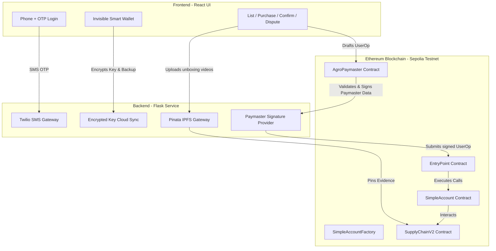

# 🌾 AgroChainMart: A Decentralized Trust Protocol for Global Agriculture

AgroChainMart is a high-fidelity, peer-to-peer agricultural marketplace bridging physical produce with the **Ethereum Blockchain**. By combining **ERC-4337 Account Abstraction**, **Smart Escrow**, **IPFS Evidence Pinning**, and a **Decentralized Tribunal (Hybrid Consensus Court)**, AgroChainMart eliminates the trust gap between farmers and buyers worldwide while removing standard Web3 complexity.

---

## 🏗️ Architectural Overview & Protocol Mechanics

AgroChainMart is built on a "Web2.5" design philosophy. It provides farmers and buyers with a web-native experience (using familiar inputs like phone numbers and PINs) while securing every financial movement on-chain.



### ⚡ The Identity Protocol: "Invisible Wallets"
Traditional Web3 onboarding is a major hurdle. AgroChainMart incorporates **non-custodial account abstraction**:
* **Phone + PIN Registration:** No MetaMask or wallet extension is required. Users enter their phone number and receive a secure OTP via Twilio SMS.
* **Non-Custodial Private Keys:** Cryptographic keys are generated locally in the browser, encrypted with the user's secret PIN, and stored in localStorage.
* **The AgriVault Cloud Backup:** The encrypted wallet JSON blob is backed up to the Flask backend. In case of device migration or browser clearout, users can trigger an OTP-verified restore to retrieve their encrypted vault, restoring local access after entering their PIN.
* **Agri-Gas ATM & AgroPaymaster:** Instead of forcing users to acquire and hold ETH for gas fees, transactions are compiled as ERC-4337 `UserOperations`. The Flask server acts as a paymaster relayer. It validates operations and signs off via the custom `AgroPaymaster` contract, sponsoring the gas fees to provide a gasless user experience.

### ⚖️ Smart Escrow & IPFS Evidence Pinning
To ensure quality control and delivery verification:
1. **Crop Listing:** Farmers list crop batches with quantity, location, price, and expiry. Listing a root harvest requires a 5% security stake to prevent spam listings (which can be sponsored by the Admin for first-time farmers).
2. **Purchase:** The buyer purchases a batch, locking the purchase price in the `SupplyChainV2` contract's escrow.
3. **One-Write Packing Video (Video 1):** Before dispatch, the farmer must upload a crop-packing video. The file is pinned to IPFS via Pinata, and its IPFS CID hash is written immutably onto the smart contract listing.
4. **Dispatch:** The farmer records delivery tracking details (carrier reference) on-chain, changing the batch status to `Dispatched`.
5. **OTP delivery & Confirm:** Upon delivery, the buyer inspects the goods. If they are satisfied, they share an OTP with the delivery agent. The buyer then invokes `confirmDelivery` (submitting a delivery video hash, Video 2), which releases the escrow funds to the farmer and returns the farmer's listing stake. A **partial release** is also supported if only a portion of the batch meets requirements.

### 🏛️ The Judicial Layer: Hybrid Consensus
Disputes are resolved through a decentralized court consisting of 5 randomly assigned arbitrators from a verified pool:
* **Arbitrator Pool & APMC Credentials:** Anyone can apply to become an arbitrator by staking an initial bond (0.01 ETH) and submitting agricultural credentials (e.g., APMC License ID, Name, Phone). Existing active arbitrators vote to approve or deny candidates.
* **Dispute Escalation:** If crops arrive spoiled, the buyer locks a dispute bond and reports the issue. If the farmer failed to upload a packing video (Video 1), the dispute auto-resolves in the buyer's favor. If Video 1 is present, a dispute is created and 5 arbitrators are assigned.
* **Arbitration Voting:** Assigned arbitrators review Video 1 (packing) and Video 2 (delivery unboxing) hosted on IPFS. They cast blind votes.
* **First-to-3 Majority Finality:** The dispute resolves immediately once a side reaches 3 votes.
* **Staking Rewards & Penalties:** 
  * Winning arbitrators split the losing party's bond/stake as a reward.
  * Winning-side arbitrators receive a rating increment (+0.10).
  * Losing-side (minority) arbitrators receive a rating penalty (-0.20).
  * If an arbitrator's rating drops below 3.0, they are disqualified and removed from the pool.

---

## 🛠️ Project Directory Structure

```directory
AgroChainMart/
├── backend/                   # Flask Server Application
│   ├── contracts/             # Deployed contracts' ABI and Addresses (loaded dynamically)
│   ├── app.py                 # Core API endpoints & relayer logic
│   ├── config.py              # Configuration constants
│   ├── contract.py            # Contract interaction helpers
│   ├── main.py                # WSGI entrypoint / server runner
│   ├── requirements.txt       # Python dependencies
│   └── services.py            # Utility helper services (IPFS, Twilio, etc.)
│
├── blockchain/                # Hardhat Project (Solidity Smart Contracts)
│   ├── contracts/             # Solidity contracts
│   │   ├── EntryPoint.sol     # ERC-4337 EntryPoint contract
│   │   ├── SimpleAccount.sol  # Non-custodial Smart Account implementation
│   │   ├── AgroPaymaster.sol  # Gas sponsorship paymaster contract
│   │   ├── SupplyChain.sol    # Core Marketplace contract (Legacy/V1)
│   │   └── SupplyChainV2.sol  # Upgraded Marketplace with Tribunal & Fractions
│   ├── scripts/               # Hardhat deployment & maintenance scripts
│   ├── test/                  # Smart contract unit tests
│   ├── hardhat.config.js      # Hardhat configuration file
│   └── package.json           # Blockchain tool dependencies
│
├── frontend/                  # React Single-Page Application (CRA)
│   ├── public/                # Static assets & HTML templates
│   ├── src/                   # Client-side code
│   │   ├── components/        # Reusable UI elements (Navbar, Footer, Modals)
│   │   ├── pages/             # Layout view pages (Dashboards, Logins, Applies)
│   │   ├── utils/             # Cryptographic & Web3 helper services
│   │   ├── App.jsx            # Main app router and coordinator
│   │   └── index.js           # Client-side mounting entrypoint
│   └── package.json           # Frontend dependencies
│
└── README.md                  # This documentation file
```

---

## 🔌 API Documentation (Backend)

The backend runs a Flask server on port `5000` to support Twilio OTP, AgriVault backups, IPFS uploads, and the ERC-4337 Relayer.

### 🔑 Identity & OTP Gateway
* **`POST /api/otp/send`**
  * Initiates verification by sending an SMS OTP.
  * **Payload:** `{ "phone": "+91XXXXXXXXXX" }`
  * **Behavior:** Sends a real Twilio OTP if the number matches `VERIFIED_DEMO_PHONE`. Otherwise, falls back to sandbox simulation and returns a simulated code.
* **`POST /api/otp/verify`**
  * Validates the OTP.
  * **Payload:** `{ "phone": "+91XXXXXXXXXX", "code": "XXXXXX" }`

### 💾 Cloud AgriVault Sync
* **`POST /api/wallet/save`**
  * Backs up encrypted wallet JSON.
  * **Payload:** `{ "phone": "+91XXXXXXXXXX", "encrypted_json": "..." }`
* **`POST /api/wallet/recover`**
  * Recovers encrypted wallet JSON.
  * **Payload:** `{ "phone": "+91XXXXXXXXXX", "code": "XXXXXX" }` (requires valid OTP check)

### ⛽ ERC-4337 Paymaster Relayer
* **`POST /api/paymaster/sign`**
  * Sponsoring check. Generates cryptographic signature for gasless `UserOperation` if valid.
  * **Payload:** `{ "userOp": { ... } }`
  * **Response:** `{ "status": "success", "paymasterAndData": "..." }`
* **`POST /api/userop/submit`**
  * Relays signed `UserOperation` to the blockchain `EntryPoint` contract by invoking `handleOps`.
  * **Payload:** `{ "userOp": { ... } }`
  * **Response:** `{ "status": "success", "tx_hash": "0x..." }`

### 📹 IPFS Upload
* **`POST /api/ipfs/upload`**
  * Uploads video files to Pinata.
  * **Format:** `multipart/form-data` with key `file` containing the video.
  * **Response:** `{ "status": "success", "ipfs_hash": "..." }`

## 🚀 Installation & Run Guide

The frontend application is built to run locally while communicating with the remote deployed backend. Therefore, **running the backend server locally is completely optional**.

### 1. Smart Contract Setup & Compilation (`blockchain`)
Navigate into the blockchain folder:
```bash
cd blockchain
npm install
```

#### Environment Setup
Create a `.env` file in the `blockchain/` directory using this template:
```env
SEPOLIA_RPC_URL=https://eth-sepolia.g.alchemy.com/v2/YOUR_ALCHEMY_KEY
PRIVATE_KEY=YOUR_ADMIN_DEPLOYER_PRIVATE_KEY
ETHERSCAN_API_KEY=YOUR_ETHERSCAN_VERIFICATION_KEY
```

#### Key Hardhat Tasks
* **Compile Contracts:**
  ```bash
  npx hardhat compile
  ```
* **Run Smart Contract Unit Tests:**
  ```bash
  npx hardhat test
  ```
* **Deploy Contracts to Sepolia:**
  ```bash
  npx hardhat run scripts/deploy.js --network sepolia
  ```

---

### 2. Frontend App Setup (`frontend`)
Navigate into the frontend folder:
```bash
cd frontend
npm install
```

#### Environment Setup
Create a `.env` file in the `frontend/` directory. Set `REACT_APP_API_URL` to your deployed backend service URL (e.g., hosted on Render or similar):
```env
REACT_APP_API_URL=https://your-deployed-backend-url.com
REACT_APP_ALCHEMY_RPC_URL=https://eth-sepolia.g.alchemy.com/v2/YOUR_ALCHEMY_KEY
```

#### Run the Client
Launch the React application:
```bash
npm start
```
The app will open automatically in your browser at `http://localhost:3000`.

---

### 3. Optional: Local Backend Server Setup (`backend`)
If you wish to run a local instance of the backend for development or debugging:
Navigate into the backend folder:
```bash
cd backend
```

#### Install dependencies
It is recommended to run within a Python Virtual Environment:
```bash
# Create virtual environment
python -m venv venv

# Activate virtual environment
# On Windows:
.\venv\Scripts\activate
# On macOS/Linux:
source venv/bin/activate

# Install requirements
pip install -r requirements.txt
```

#### Environment Setup
Create a `.env` file in the `backend/` directory:
```env
ALCHEMY_RPC_URL=https://eth-sepolia.g.alchemy.com/v2/YOUR_ALCHEMY_KEY
ADMIN_PRIVATE_KEY=YOUR_RELAYER_PAYMASTER_SIGNER_KEY
ADMIN_ADDRESS=YOUR_RELAYER_PAYMASTER_SIGNER_ADDRESS

# Twilio (Optional: Leave empty to fall back to Sandbox OTP simulation)
TWILIO_ACCOUNT_SID=
TWILIO_AUTH_TOKEN=
TWILIO_VERIFY_SERVICE_SID=
VERIFIED_DEMO_PHONE=

# Pinata IPFS Gateway
PINATA_API_KEY=YOUR_PINATA_API_KEY
PINATA_SECRET_KEY=YOUR_PINATA_SECRET_KEY
```

#### Run the Server
Launch the Flask development server:
```bash
python main.py
```
The backend API will run on `http://127.0.0.1:5000`.

---

## 🛡️ Protocol Security & Recovery Warnings
* **Non-Custodial Account Recovery:** Raw private keys are never transmitted to or stored on the backend. When creating an account, an encryption PIN is input by the user. If you lose your account recovery PIN and lose access to your local device, funds associated with the smart account are **mathematically irrecoverable**.
* **IPFS Immutability:** Pre-packing videos represent the baseline evidence for agricultural consensus. Once pinned, their CID hash is locked inside the smart contract and cannot be edited.

---
**© 2026 AgroChainMart. The Mathematical Future of Farming.**
